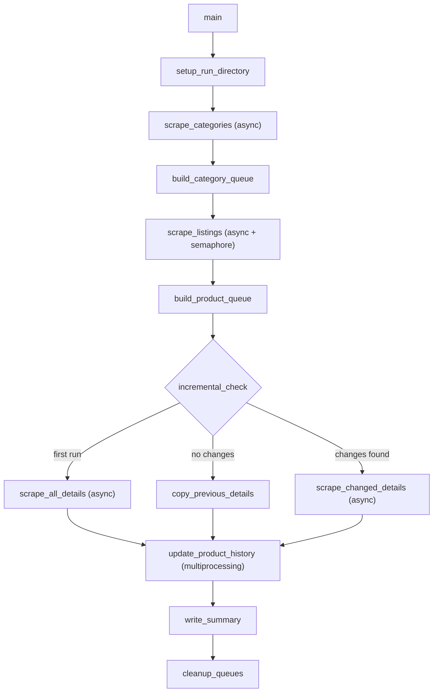

# Allani E-commerce Web Scraper — High-Performance Edition

## Project Structure

```
GALYLIO/
  requirements.txt
  shop/
    config.py
    scraper.py
    data/          (created at runtime)
```

## Step 1 — Environment and Dependencies

- Create a Python venv at the project root
- Generate `requirements.txt` with:
  - `**httpx[http2]**` — async HTTP client with HTTP/2 multiplexing and connection pooling (replaces `requests`; benchmarks 3-5x faster under concurrency)
  - `**selectolax**` — Lexbor-engine HTML parser with CSS selector support (C bindings; **20-30x faster** than BeautifulSoup for parsing + querying)
  - `**orjson`** — Rust-based JSON library (**3-10x faster** serialize/deserialize than stdlib `json`; critical for large product datasets)
  - `**fake-useragent`** — user-agent rotation

Stdlib modules used: `asyncio`, `multiprocessing`, `datetime`, `pathlib`, `time`, `random`, `copy`, `re`, `logging`, `shutil`, `os`.

### Why this stack is fastest

- **httpx async** — a single event loop manages hundreds of concurrent HTTP connections with zero thread overhead. HTTP/2 multiplexes requests over a single TCP connection, eliminating per-request handshake cost.
- **selectolax (Lexbor)** — parses HTML into a tree and runs CSS selectors in compiled C, not interpreted Python. On a ~900-product catalog this saves seconds of cumulative parse time.
- **orjson** — serializes `products_raw.json` / `details_raw.json` / `product_history.json` in microseconds instead of milliseconds. Also handles `datetime` natively.
- **asyncio over threading** — no GIL contention, no thread-creation overhead, ~10KB per coroutine vs ~8MB per thread stack. Scales to the concurrency limit set in config without resource pressure.

## Step 2 — `shop/config.py`

Single source of truth for all configuration. Contains:

- **Base URL**: `https://allani.com.tn`
- **CSS Selectors** — organized in nested dicts exactly matching the user-provided YAML:
  - `CATEGORY_SELECTORS` — navbar container, top/low/sub categories
  - `LISTING_SELECTORS` — article element, id, name, url, image, price, old_price, reference, ean, description_short, promo_flag, availability
  - `PAGINATION_SELECTORS` — container, page list, current, next, total, no-more-pages pattern, URL pattern (`?page={n}`)
  - `DETAIL_SELECTORS` — title, brand, reference, ean, price, old_price, availability, description, images (main + thumbnails), schema availability
- **Retry settings**: `MAX_RETRIES = 3`, `BACKOFF_BASE = 2`, `BACKOFF_MAX = 30`
- **Delay settings**: `MIN_DELAY = 1.0`, `MAX_DELAY = 3.0` (seconds between requests — tighter than before, async handles timing better)
- **Concurrency limits**: `MAX_CONCURRENT_REQUESTS = 8` (asyncio semaphore), `PROCESS_POOL_SIZE = 2`
- **httpx tuning**: `CONNECT_TIMEOUT = 10`, `READ_TIMEOUT = 30`, `POOL_MAX_CONNECTIONS = 20`, `POOL_MAX_KEEPALIVE = 5`
- **Paths**: `DATA_DIR`, `QUEUE_DIR` (all relative to `shop/data/`)
- **User-agent list** and **header fingerprint templates** for rotation

## Step 3 — `shop/scraper.py`

Organized into clearly-separated function groups. The high-level flow:




### Function Groups

**Setup**

- `setup_run_directory()` — creates timestamped output folder `shop/data/YYYY-MM-DD_HH-MM-SS/`
- `setup_logging()` — configures logging to stdout + file
- `get_previous_run()` — finds the latest previous run folder (if any) for incremental mode

**Anti-Detection / HTTP (async)**

- `create_client()` — returns an `httpx.AsyncClient` configured with HTTP/2, connection pool limits from config, rotated user-agent, and randomized header fingerprint
- `safe_request(url, client, semaphore)` — async GET with exponential backoff + jitter; acquires the `asyncio.Semaphore(MAX_CONCURRENT_REQUESTS)` before each request to cap concurrency; returns `(response_text, error)` tuple; never raises
- `random_delay()` — `await asyncio.sleep(random.uniform(MIN_DELAY, MAX_DELAY))`

**HTML Parsing (selectolax)**

- All parsing uses `selectolax.parser.HTMLParser` with `.css()` and `.css_first()` for CSS selectors
- `parse_node_text(node)` — safely extracts trimmed text from a selectolax `Node`
- `parse_node_attr(node, attr)` — safely extracts an attribute value

**Categories**

- `scrape_categories(client)` — async; fetches homepage, parses `ul#top-menu` via selectolax for top/low/sub categories; builds flat list with `id, name, url, parent_id, level`; saves `categories.json` via orjson
- `extract_category_id(node)` — parses `category-{id}` from parent `li[id]`
- `get_leaf_categories(categories)` — filters to categories with no children (leaves only)

**Queue Management** (coroutine-safe)

- `QueueFile` class — wraps a `.txt` queue file with `[PENDING]`, `[DONE]`, `[ERROR]` sections; uses `asyncio.Lock` for all reads/writes (safe across concurrent coroutines)
  - `load()` / `save()` / `move_to_done(key)` / `move_to_error(key)` / `get_next_pending()` / `all_done()`
- `build_category_queue(leaf_categories)` — creates `category_queue.txt`
- `build_product_queue(products)` — creates `product_queue.txt`

**Listing Scraping (async)**

- `scrape_listing_page(html)` — parses one page of product cards with selectolax; handles lazy-loaded images by checking `data-src` then `src` attributes
- `scrape_category_listings(category, queue, client, semaphore)` — async; paginates through all pages for one category using `next_page` link; collects all products; moves queue entry to DONE/ERROR
- `scrape_all_listings(queue, categories)` — gathers all category scraping coroutines via `asyncio.gather` with a shared semaphore for rate limiting; each coroutine uses the shared `httpx.AsyncClient` (connection pool handles multiplexing); saves `products_raw.json` via orjson

**Detail Scraping (async)**

- `scrape_product_detail(url, client, semaphore)` — async; fetches and parses one product detail page via selectolax; extracts all fields from `DETAIL_SELECTORS`
- `scrape_details_for_queue(queue, product_urls)` — gathers via `asyncio.gather` with semaphore; saves `details_raw.json` via orjson

**Incremental Diffing (multiprocessing for CPU-bound work)**

- `diff_products(current_listings, previous_listings)` — runs in a `ProcessPoolExecutor(PROCESS_POOL_SIZE)` via `asyncio.get_event_loop().run_in_executor()`; compares price + availability; returns `{new: [...], removed: [...], changed: [...], unchanged: [...]}`
- `patch_details(previous_details, changed_details, removed_ids, new_details)` — also offloaded to process pool; merges changed/new detail records into previous dataset; marks removed products with `"removed": true`; produces full updated `details_raw.json`

**Change Tracking**

- `update_product_history(current_data, run_timestamp)` — reads/creates `shop/data/product_history.json` (via orjson); for each product, appends to `price_history` and `availability_history` only when value actually changed from previous entry; sets `first_seen` and `removed_at` as appropriate
- Designed for future queries: price trends, availability timeline, added/removed by week/month/year

**Summary and Cleanup**

- `write_summary(run_dir, stats)` — writes `summary.json` via orjson with total products, errors, duration, timestamp, and whether run was "no changes"
- `cleanup_queues()` — deletes `category_queue.txt` and `product_queue.txt` after successful run

**Main Entrypoint**

- `main()` — async entrypoint; orchestrates the full pipeline; wraps everything in a top-level try/except so no single failure crashes the run
- `if __name__ == "__main__": asyncio.run(main())` — standard async entry

## Key Design Decisions

- **Async-first I/O**: All HTTP requests go through `httpx.AsyncClient` with an `asyncio.Semaphore` to cap concurrency at `MAX_CONCURRENT_REQUESTS`. This is faster than threading because there is no GIL contention and coroutines cost ~10KB each vs ~8MB per thread.
- **HTTP/2 multiplexing**: `httpx[http2]` sends multiple requests over a single TCP connection, eliminating repeated TLS handshakes against allani.com.tn.
- **Selectolax (Lexbor)**: All HTML parsing uses compiled C code. CSS selectors like `article.product-miniature` resolve in microseconds, not milliseconds.
- **orjson for all JSON I/O**: `products_raw.json` (potentially thousands of records) serializes/deserializes 3-10x faster than stdlib `json`. Also handles `datetime` objects natively.
- **Coroutine safety**: The `QueueFile` class uses `asyncio.Lock` for all reads/writes, safe across concurrent coroutines within the event loop.
- **Process safety**: CPU-bound diffing and patching run in `ProcessPoolExecutor` offloaded via `loop.run_in_executor()`, keeping the async event loop unblocked.
- **Lazy images**: The listing parser checks `data-src` first (lazy-loaded attribute), then `src`, then `data-image-large-src` for thumbnails.
- **Incremental logic**: On second+ runs, listings are scraped first (price + availability only), diffed against previous `products_raw.json`. Only changed/new products trigger detail page scrapes. Removed products are marked, not re-scraped.
- **No hardcoding**: Every selector, URL, delay, path, and concurrency limit lives in `config.py`. `scraper.py` imports everything from config.
- **Raw data only**: No cleaning or transformation — data is saved as scraped.

