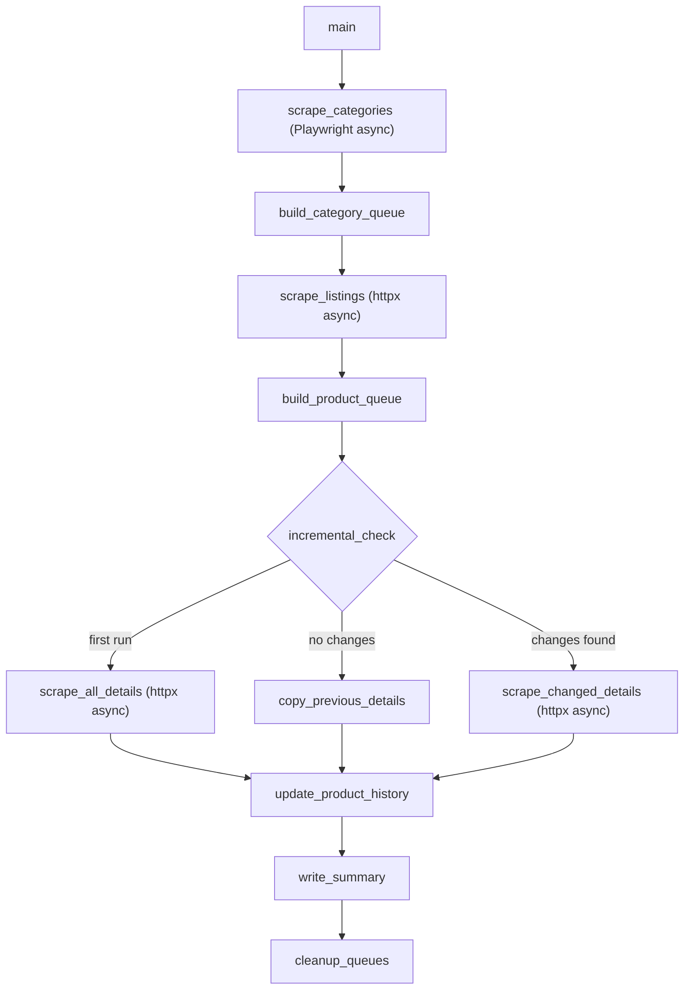

# Batam E-commerce Web Scraper

## Key Difference from Allani

The batam.com.tn homepage renders its category navigation menu client-side via Alpine.js. A plain HTTP GET returns an empty `ul.level-0` container. **Playwright (async)** is the right tool for this: it launches a headless Chromium browser, waits for Alpine.js to hydrate, then returns the fully-rendered HTML. After category extraction, Playwright is closed and the rest of the pipeline uses the same httpx + selectolax + orjson stack as allani (listings and details are SSR).




## Project Structure

```
GALYLIO/
  requirements.txt          (add playwright)
  .venv/
  allani/                   (existing)
  batam/
    config.py
    scraper.py
    data/                   (created at runtime)
```

## Step 1 -- Add Playwright Dependency

Add `playwright` to [requirements.txt](requirements.txt) and run `playwright install chromium` to download the browser binary. This is needed only for category scraping (CSR page).

Updated `requirements.txt`:

```
httpx[http2]>=0.27.0
selectolax>=0.3.21
orjson>=3.9.0
fake-useragent>=1.4.0
playwright>=1.40.0
```

## Step 2 -- `batam/config.py`

Mirrors [allani/config.py](allani/config.py) structure. Key differences:

- **BASE_URL**: `https://batam.com.tn`
- **CATEGORY_SELECTORS**: `ul.level-0 > li.parent-ul-list` for top, `ul.level-1 > li` for low, `ul.level-2 > li` for sub
- **LISTING_SELECTORS**: Magento 2 structure -- product ID from `input[name='product'][value]`, has `old_price` and `price_numeric` via `data-price-amount`, availability via color-class spans (`span.text-green-500`, `span.text-blue`)
- **PAGINATION_SELECTORS**: Magento `?p={n}` pattern, `li.pages-item-next a.action.next`
- **DETAIL_SELECTORS**: `h1.page-title span.base[itemprop='name']`, price from `meta[itemprop='price']`, specs table (`#product-attribute-specs-table`), images from `div#gallery img`
- **Playwright config**: `PLAYWRIGHT_TIMEOUT = 15000` (ms to wait for Alpine.js hydration), `PLAYWRIGHT_HEADLESS = True`
- Same retry/delay/concurrency/paths/UA/header patterns as allani

## Step 3 -- `batam/scraper.py`

Same function groups as [allani/scraper.py](allani/scraper.py) (930 lines), adapted for Magento 2 selectors and the Playwright category step. Specific changes:

### Categories (Playwright)

`scrape_categories()` uses `playwright.async_api`:

1. Launch headless Chromium
2. Navigate to `BASE_URL`
3. Wait for `ul.level-0 > li.parent-ul-list` to appear (Alpine.js hydration)
4. Get `page.content()` -- fully rendered HTML
5. Close browser
6. Parse the rendered HTML with selectolax (same as allani from this point)
7. Walk `ul.level-0 > li.parent-ul-list` for top categories, `ul.level-1 > li` for low, `ul.level-2 > li` for sub

Category IDs are extracted from the category URL slug (Magento pattern: `/category-slug.html` -- extract slug as ID since Magento doesn't expose numeric IDs in the nav).

### Listings (httpx -- SSR)

- Product ID extracted from `input[name='product'][value]` inside each `form.item.product` card
- Image from `img.product-image-photo[src]` (SSR, no lazy-load)
- Price from `span[data-price-type='finalPrice'] span.price` (text) and `span[data-price-type='finalPrice'][data-price-amount]` (numeric)
- Old price from `span[data-price-type='oldPrice'] span.price`
- Availability from `span.text-green-500` or `span.text-blue` (color-class based)
- Pagination: follow `li.pages-item-next a.action.next` href, stop when absent

### Details (httpx -- SSR)

- Title: `h1.page-title span.base[itemprop='name']`
- Price: `div.price-container .final-price .price` (display) + `meta[itemprop='price']` (numeric)
- Old price: `div.price-container .old-price .price`
- Availability: `p.unavailable.stock span`
- Description: `div.product-description`
- Specs: iterate `#product-attribute-specs-table tr`, extract `th.col.label` / `td.col.data` pairs
- Images: `div#gallery img[src]` (main only, no thumbnails selector)
- Reference: `input[name='product'][value]`

### Everything Else -- Identical to Allani

The following are copied and adapted with zero logic changes:

- `QueueFile` class (asyncio.Lock)
- `build_category_queue()` / `build_product_queue()`
- `safe_request()` / `create_client()` / `random_delay()`
- `diff_products()` / `patch_details()` (ProcessPoolExecutor)
- `update_product_history()` (product_history.json)
- `write_summary()` / `cleanup_queues()`
- `main()` orchestration pipeline

