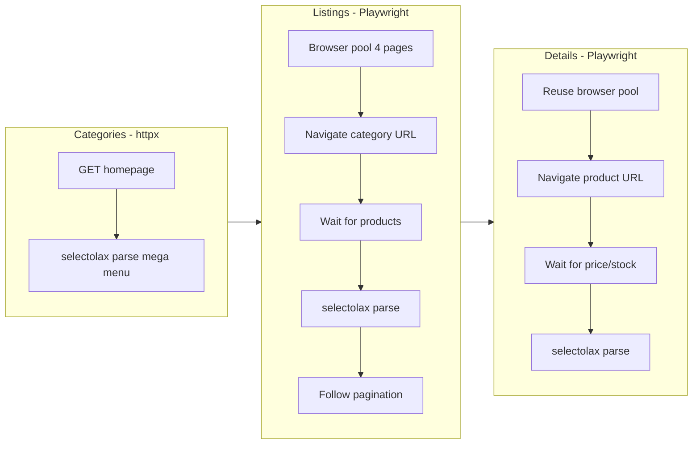

# Add Mytek Shop Scraper

New shop: `mytek/` following the same isolated-shop rules. Magento 2 (Rootways Megamenu). Unique rendering model discovered via live testing:

## Site rendering analysis (tested)


| Page type | SSR (httpx) | CSR (Playwright) | Decision |
| --------- | ----------- | ---------------- | -------- |


- **Categories** (homepage mega menu): Fully SSR -- `ul.vertical-list`, all 14 top categories, low/sub categories with URLs all present in raw HTML. Use **httpx + selectolax**.
- **Listings** (category pages): CSR -- first page has no products without JS; page 2+ has `product-container` divs in HTML but `data-product-id` attributes are JS-injected. Use **Playwright**.
- **Details** (product pages): Partially SSR -- title, SKU, specs, description, shop availability, installment all present. But `div.product-info-price` (pricing section) and stock status are JS-rendered. Use **Playwright** for complete data.

## Architecture




Key difference from other shops: **Playwright browser pool** for listings and details. A pool of N browser pages (default 4) is shared via an async queue. Each worker acquires a page, navigates, waits for content, extracts HTML, then returns the page to the pool.

## Pagination

Discovered pattern: `?id={category_id}&p={n}` where `category_id` is extracted from pagination links on the first listing page. Example: `/pc-portable.html` page 1 has pagination link to `?id=38&p=2`. The scraper:

1. Loads first page via Playwright
2. Extracts `category_id` from any pagination `a.page-link[href]` using regex `[?&]id=(\d+)`
3. For subsequent pages, navigates to `{category_url}?id={cat_id}&p={n}`
4. Stops when the last `li.page-item` has class `disabled` (no next page)

## Files to create

### `mytek/config.py`

Translate user YAML selectors. Key sections:

- `BASE_URL = "https://www.mytek.tn"`
- **No** `PLAYWRIGHT_WAIT_SELECTOR` for categories (SSR), but `PLAYWRIGHT_LISTING_WAIT = "div.product-container[data-product-id]"` and `PLAYWRIGHT_DETAIL_WAIT = "div.product-info-price"`
- `PLAYWRIGHT_TIMEOUT = 20000` (slightly higher -- JS-heavy pages)
- `BROWSER_POOL_SIZE = 4`
- `CATEGORY_SELECTORS` -- Rootways Megamenu: `nav_container`, `top_items` (`li.rootverticalnav.category-item`), `top_name` (`a span.main-category-name em`), `low_blocks` (`div.title_normal`), `low_link` (`a`), `sub_lists` (`ul.level3-popup, ul.level4-popup`), `sub_items` (`li.category-item > a`), `sub_name` (`span.level3-name, span.level4-name`)
- `URL_PATTERNS` -- `category_id_from_pagination: r"[?&]id=(\d+)"`
- `LISTING_SELECTORS` -- element `div.product-container.card[data-product-id]`, id attr `data-product-id`, name `h1.product-item-name a.product-item-link`, price `span.final-price`, old_price `span.original-price`, sku `div.sku`, availability `div.stock`, brand `div.brand a img`, image `img[id^='seImgProduct_']`
- `PAGINATION_SELECTORS` -- container `nav.custom-pagination`, next via last `li.page-item` disabled check, url_pattern `?id={cat_id}&p={n}`
- `DETAIL_SELECTORS` -- title `h1.page-title span.base`, sku `div.product.attribute.sku div.value[itemprop='sku']`, price `div.product-info-price span.price`, old_price `span.old-price span.price`, special_price `span.special-price span.price`, discount `span.discount-price`, availability `div.product-info-stock-sku div.stock[itemprop='availability']`, description `#description`, specs table `#product-attribute-specs-table`, per-shop availability `#block_synchronizestok #shop_container table.tab_retrait_mag`, installment `#synchronizestock_block_paiement`, images
- Standard retry/delay/concurrency/paths/UA/header sections

### `mytek/scraper.py`

Based on [expert_gaming/scraper.py](expert_gaming/scraper.py) architecture, adapted for the hybrid CSR model:

- **Browser pool**: `BrowserPool` class -- creates N Playwright pages, exposes `async acquire() -> Page` and `async release(page)` via `asyncio.Queue`. Launched once, shared for listings + details.
- **Categories (httpx)**: `create_client()` fetches homepage, selectolax parses `ul.vertical-list > li.rootverticalnav`. Top categories have `url: null` (containers). Low from `div.title_normal a`. Sub from `ul.level3-popup, ul.level4-popup` inside each low block. Build flat list with id/name/url/parent_id/level.
- **Listings (Playwright)**: For each leaf category, acquire page from pool, navigate to category URL, wait for `div.product-container[data-product-id]`. Parse with selectolax. Extract `category_id` from pagination links. Paginate via `?id={cat_id}&p={n}`, stop when last `li.page-item` is disabled. Product ID from `data-product-id` attr.
- **Details (Playwright)**: For each product URL, acquire page from pool, navigate, wait for `div.product-info-price`, parse with selectolax. Extract title, SKU, full price triplet, stock, description, specs, per-shop availability (with classes `.enStock`, `.erpCommande`, `.erpArivage`), installment, images.
- **Queue/diff/patch/history/summary/cleanup**: Same self-contained logic as all other shops.

## Project structure

```
mytek/
    __init__.py
    config.py
    scraper.py
    data/          (created at runtime)
```

Run with: `python -m mytek.scraper`