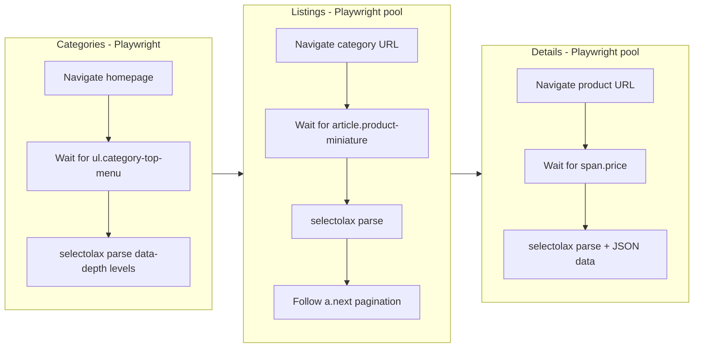

# Add SBS Informatique Shop Scraper

New shop: `sbs/` following the same isolated-shop rules. PrestaShop + TvCMS MegaMenu. **Fully CSR** -- Playwright browser pool for all three phases.

## Architecture

Since the entire site is CSR, the architecture is closest to [mytek/scraper.py](mytek/scraper.py) but with Playwright also for categories (mytek used httpx for categories).



## Key differences from other shops

- **Full CSR**: All three phases use Playwright (categories + listings + details)
- **PrestaShop**: Similar selectors to allani (`data-depth`, `article.product-miniature`, `data-id-product`)
- **TvCMS theme**: Products rendered in 4 views (grid, grid-2, list, catalog) -- must scope to `.tvproduct-wrapper.grid`
- **Availability**: Button-based check (`button.tvproduct-out-of-stock.disable[disabled]` vs `button.add-to-cart:not(.disable)`) plus `div.outofstock-category` / `div.disponible-category`
- **Pagination**: `?page={n}` (simple like allani)
- **Detail JSON**: `#product-details[data-product]` contains structured product JSON -- can extract ID, price, availability from this as fallback
- **Stock bar**: `div.dispo-haut-bar div.tv-inner` with classes `tv-lvl-0` to `tv-lvl-4`
- **Pack items**: Some products have pack items at `div.product-pack article`

## Files to create

### `sbs/config.py`

- `BASE_URL = "https://www.sbsinformatique.com"`
- `PLAYWRIGHT_TIMEOUT = 20000`, `PLAYWRIGHT_HEADLESS = True`
- `PLAYWRIGHT_CATEGORY_WAIT = "div.block-categories ul.category-top-menu"` (wait for mega menu)
- `PLAYWRIGHT_LISTING_WAIT = "article.product-miniature.js-product-miniature"` (wait for products)
- `PLAYWRIGHT_DETAIL_WAIT = "div.current-price span.price"` (wait for price render)
- `BROWSER_POOL_SIZE = 4`
- `CATEGORY_SELECTORS` -- PrestaShop `data-depth` levels:
  - `nav_container`: `div.block-categories ul.category-top-menu`
  - `top_items`: `li[data-depth='0'] > a`
  - `low_items`: `li[data-depth='1'] > a.category-sub-link`
  - `sub_items`: `li[data-depth='2'] > a.category-sub-link, li[data-depth='3'] > a.category-sub-link`
- `URL_PATTERNS` -- `id_from_url: r"/(\d+)(?:-|$)"` (PrestaShop numeric ID in URL)
- `LISTING_SELECTORS` -- element `article.product-miniature.js-product-miniature`, id attr `data-id-product`, name from `.tvproduct-wrapper.grid h6[itemprop='name']`, price from `.tvproduct-wrapper.grid .product-price-and-shipping span.price`, availability from button disabled state + catalog view divs
- `PAGINATION_SELECTORS` -- next `a.next.js-search-link[rel='next']`, url_pattern `?page={n}`
- `DETAIL_SELECTORS` -- title `h1.h1[itemprop='name']`, brand `a.tvproduct-brand img`, reference `span[itemprop='sku']`, price `span.price[itemprop='price'][content]` (with `content` attr for numeric), availability `span#product-availability` + schema link + stock bar, description, specs (`dl.data-sheet` with `dt.name`/`dd.value`), images, JSON data `#product-details[data-product]`, installment/pack_items
- Standard retry/delay/concurrency/paths/UA/header sections

### `sbs/scraper.py`

Based on [mytek/scraper.py](mytek/scraper.py) `BrowserPool` architecture, fully CSR:

- **BrowserPool**: Same as mytek -- `asyncio.Queue` of N pages
- **Categories (Playwright)**: Use one page from pool, navigate to `BASE_URL`, wait for `PLAYWRIGHT_CATEGORY_WAIT`, extract HTML, parse with selectolax. `data-depth` levels: top (`0`), low (`1`), sub (`2`/`3`). IDs from URL regex. Top categories have URLs (unlike mytek where they didn't).
- **Listings (Playwright pool)**: Navigate to category URL, wait for products, parse `.tvproduct-wrapper.grid` scoped elements. ID from `article[data-id-product]`. Availability from button disabled check + catalog view divs. Paginate via `a.next.js-search-link[rel='next']` href.
- **Details (Playwright pool)**: Navigate to product URL, wait for price. Parse title, brand (img src), reference/SKU, price (from `content` attr), old_price, availability (text + schema link + stock bar level), description, specs (dl-based), images. Also try JSON from `#product-details[data-product]` as structured fallback for ID/price/availability.
- **Queue/diff/patch/history/summary/cleanup**: Same self-contained logic as all other shops

## Project structure

```
sbs/
    __init__.py
    config.py
    scraper.py
    data/          (created at runtime)
```

Run with: `python -m sbs.scraper`
