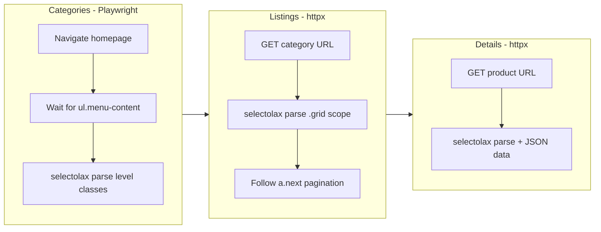

# Add Scoop Gaming Shop Scraper

New shop: `scoop/` following the same isolated-shop rules. PrestaShop + TvCMS MegaMenu (identical engine to SBS). CSR homepage (Playwright for categories), SSR listings and details (httpx + selectolax) -- same hybrid as expert_gaming.

## Architecture

Closest to [expert_gaming/scraper.py](expert_gaming/scraper.py) (Playwright categories, httpx the rest), but with SBS-style TvCMS listing/detail selectors.



## Key differences from SBS

- **Categories**: Different structure -- CSS class-based levels (`li.level-1`, `li.level-2`, `li.level-3`) instead of `data-depth` attributes. **Two structural patterns** in the mega menu:
  1. Standard UL dropdown: `li.level-2 > a` inside `ul.menu-dropdown`
  2. Mega menu columns: `li.tvmega-menu-link.item-header` (level-2) and `li.tvmega-menu-link.item-line` (level-3)
- **Nav container**: `div#tvdesktop-megamenu ul.menu-content` (not `div.block-categories ul.category-top-menu`)
- **Top category names**: Some use `a > span`, some use `a > img[alt]` -- must handle both
- **Listings/details**: Near-identical selectors to SBS (same TvCMS module), but rendered SSR so httpx works
- **No stock bar, no pack items** in YAML (simpler detail model than SBS)

## Files to create

### `scoop/config.py`

- `BASE_URL = "https://www.scoop-gaming.tn"`
- `PLAYWRIGHT_TIMEOUT = 15000`, `PLAYWRIGHT_HEADLESS = True`
- `PLAYWRIGHT_WAIT_SELECTOR = "div#tvdesktop-megamenu ul.menu-content > li.level-1 > a"`
- `CATEGORY_SELECTORS` -- two-pattern mega menu:
  - `nav_container`: `div#tvdesktop-megamenu ul.menu-content`
  - `top_items`: `ul.menu-content > li.level-1`
  - `top_link`: `a`
  - `top_name_span`: `a > span`
  - `top_name_img_alt`: `a > img`
  - Standard dropdown: `low_items_dropdown`: `ul.menu-dropdown > li.level-2 > a`, `sub_items_dropdown`: `li.level-2.parent > ul.menu-dropdown > li.level-3 > a`
  - Mega menu: `low_items_mega`: `div.menu-dropdown li.tvmega-menu-link.item-header > a`, `sub_items_mega`: `div.menu-dropdown li.tvmega-menu-link.item-line > a`
- `URL_PATTERNS`: `id_from_url: r"/(\d+)(?:-|$)"`
- `LISTING_SELECTORS` -- identical to SBS (same TvCMS): `article.product-miniature`, `data-id-product`, `.tvproduct-wrapper.grid`, button-based availability
- `PAGINATION_SELECTORS` -- identical to SBS: `a.next.js-search-link[rel='next']`, `?page={n}`
- `DETAIL_SELECTORS` -- same TvCMS detail structure as SBS: title, brand img, reference/SKU, price + `content` attr, availability + schema link, description, specs `dl.data-sheet`, images, JSON data
- Standard retry/delay/concurrency/httpx/paths/UA/header sections

### `scoop/scraper.py`

Based on [expert_gaming/scraper.py](expert_gaming/scraper.py) architecture (Playwright categories + httpx SSR), adapted for TvCMS:

- **Categories (Playwright)**: Launch browser, navigate to `BASE_URL`, wait for mega menu. Parse `li.level-1` top items. For each, extract name from `a > span` text or `a > img[alt]`. Then extract children from both structural patterns: standard dropdown (`ul.menu-dropdown > li.level-2`, nested `li.level-3`) and mega menu columns (`li.tvmega-menu-link.item-header` as level-2, `li.tvmega-menu-link.item-line` as level-3). Dedup by URL.
- **Listings (httpx)**: Same TvCMS parsing as SBS -- scope to `.tvproduct-wrapper.grid`, ID from `article[data-id-product]`, availability from button disabled check + catalog view divs. Paginate via `a.next.js-search-link[rel='next']`.
- **Details (httpx)**: Same TvCMS detail parsing as SBS -- title, brand (img src), reference, price (from `content` attr), availability (text + schema link), description, specs (dl), images, JSON data fallback.
- **Queue/diff/patch/history/summary/cleanup**: Same self-contained logic

## Project structure

```
scoop/
    __init__.py
    config.py
    scraper.py
    data/          (created at runtime)
```

Run with: `python -m scoop.scraper`
