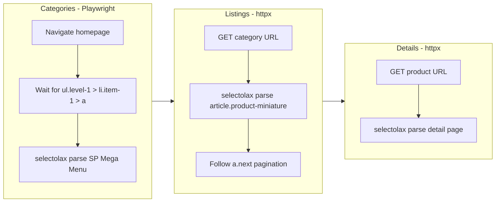

# Add Skymill Informatique Shop Scraper

New shop: `skymill/` following the same isolated-shop rules. PrestaShop + SP Mega Menu. CSR homepage (Playwright for categories), SSR listings and details (httpx + selectolax) -- same hybrid as [scoop/scraper.py](scoop/scraper.py).

## Architecture

Closest to [scoop/scraper.py](scoop/scraper.py) (Playwright categories, httpx the rest), but with SP Mega Menu selectors instead of TvCMS, and a simpler 2-level category tree.




## Key differences from Scoop/SBS

- **Platform**: PrestaShop + SP Mega Menu (not TvCMS MegaMenu)
- **Categories**: Simpler 2-level only structure (`li.item-1` top, `li.item-2` low inside `div.dropdown-menu`). No sub-categories.
- **Nav container**: `div#spverticalmenu_1 ul.level-1` (not `div#tvdesktop-megamenu`)
- **No grid scope**: No `.tvproduct-wrapper.grid` scoping needed -- SP theme renders products once per article
- **Listing name**: `h2.h3.product-title a[itemprop='url']` (not h6)
- **Price**: `span.price[aria-label='Prix']` + `meta[itemprop='price'][content]` for numeric
- **No availability on listings**: The YAML notes "No stock indicator on listing cards"
- **Discount fields**: `span.discount-amount.discount-product` and `.product-flag.discount`
- **Detail title**: `h1.product-name[itemprop='name']` (not `h1.h1`)
- **Brand**: `img.manufacturer-logo` (not `a.tvproduct-brand img`)
- **Detail price**: `.product-price span[itemprop='price'][content]`
- **Images**: Main `img.js-qv-product-cover[src]`, thumbnails `img.thumb.js-thumb[data-image-large-src]`
- **Delivery info**: Extra `span.delivery-information` field
- **Specs**: Same PrestaShop `dl.data-sheet` with `dt.name`/`dd.value` (but container is `section.product-features dl.data-sheet`)

## Files to create

### `skymill/config.py`

- `BASE_URL = "https://skymil-informatique.com"`
- `PLAYWRIGHT_TIMEOUT = 15000`, `PLAYWRIGHT_HEADLESS = True`
- `PLAYWRIGHT_WAIT_SELECTOR = "div#spverticalmenu_1 ul.level-1 > li.item-1 > a"`
- `CATEGORY_SELECTORS` -- SP Mega Menu (simple 2-level):
  - `nav_container`: `div#spverticalmenu_1 ul.level-1`
  - `top_items`: `ul.level-1 > li.item-1`
  - `top_link`: `a`
  - `low_items`: `div.dropdown-menu ul.level-2 > li.item-2 > a`
  - `link_fallback`: `a[href]`
- `URL_PATTERNS`: `id_from_url: r"/(\d+)(?:-|$)"`
- `LISTING_SELECTORS`:
  - `element`: `article.product-miniature.js-product-miniature.sp-product-style1`
  - `id_attr`: `data-id-product`
  - `name`: `h2.h3.product-title a`
  - `url`: `h2.h3.product-title a`
  - `image`: `.product-image img[itemprop='image']`, attrs `["src"]`
  - `price`: `span.price[aria-label='Prix']`
  - `price_meta`: `meta[itemprop='price']` (content attr for numeric)
  - `old_price`: `span.regular-price[aria-label='Prix de base']`
  - `discount`: `span.discount-amount.discount-product`
  - `description_short`: `.product-description-short[itemprop='description']`
  - No availability selectors (not present on listing cards)
- `PAGINATION_SELECTORS`:
  - `container`: `div#js-product-list-bottom nav.pagination`
  - `next_page`: `a.next.js-search-link`
  - `url_pattern`: `?page={n}`
- `DETAIL_SELECTORS`:
  - `title`: `h1.product-name[itemprop='name']`
  - `brand`: `img.manufacturer-logo` (attr `src`)
  - `brand_link`: `a:has(img.manufacturer-logo)` (attr `href`)
  - `reference`: `.product-reference span[itemprop='sku']`
  - `price`: `.product-price span[itemprop='price']` (content attr for numeric)
  - `old_price`: `.regular-price`
  - `global_availability`: `span#product-availability`
  - `availability_schema`: `link[itemprop='availability'][href]`
  - `delivery_info`: `span.delivery-information`
  - `description`: `.product-short-description`
  - `specs`: container `section.product-features dl.data-sheet`, key `dt.name`, value `dd.value`
  - `images`: main `img.js-qv-product-cover`, thumbnails `img.thumb.js-thumb` (use `data-image-large-src`)
- Standard retry/delay/concurrency/httpx/paths/UA/header sections

### `skymill/scraper.py`

Based on [scoop/scraper.py](scoop/scraper.py) architecture (Playwright categories + httpx SSR), adapted for SP Mega Menu:

- **Categories (Playwright)**: Launch browser, navigate to `BASE_URL`, wait for SP vertical menu. Parse `li.item-1` top items. For each, extract name from `a` text. Then extract `li.item-2` children from `div.dropdown-menu ul.level-2`. Simpler than scoop (no two-pattern issue, just one level of nesting). Dedup by URL.
- **Listings (httpx)**: Parse `article.product-miniature.sp-product-style1`, ID from `data-id-product`, name from `h2.h3.product-title a`, price from `span.price[aria-label]`, numeric price from `meta[itemprop='price'][content]`. No availability on listing cards. Paginate via `a.next.js-search-link`.
- **Details (httpx)**: Parse title `h1.product-name`, brand from `img.manufacturer-logo` src, reference/SKU, price from `.product-price span[itemprop='price'][content]`, availability from `span#product-availability` + schema link, delivery info, description, specs (dl-based), images (main + thumbnails via `data-image-large-src`).
- **Queue/diff/patch/history/summary/cleanup**: Same self-contained logic as all other shops

## Project structure

```
skymill/
    __init__.py
    config.py
    scraper.py
    data/          (created at runtime)
```

Run with: `python -m skymill.scraper`