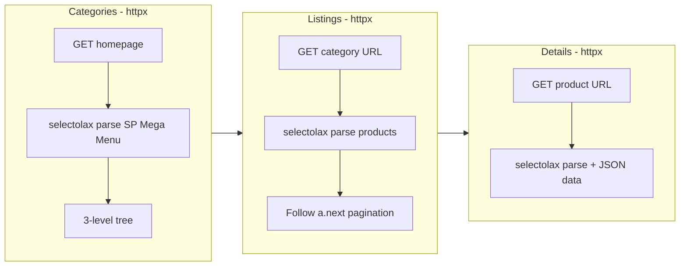

# Add Spacenet Shop Scraper

New shop: `spacenet/` following the same isolated-shop rules. PrestaShop + SP Mega Menu. **Fully SSR** -- httpx + selectolax for categories, listings, AND details. No Playwright dependency. This is the simplest architecture in the project.

## Architecture

Unlike all other shops (which need Playwright for at least categories), Spacenet is fully server-side rendered. This means we can use httpx for everything.




Closest to [skymill/scraper.py](skymill/scraper.py) (same SP Mega Menu, same httpx listings/details), but with httpx replacing Playwright for categories too, and a richer 3-level category tree + richer detail model.

## Key differences from Skymill

- **Fully SSR**: No Playwright at all -- httpx for categories too
- **Nav container**: `#sp-vermegamenu ul.level-1` (not `#spverticalmenu_1`)
- **Visibility rule**: Must filter navbar to only visible elements (skip hidden duplicates)
- **3-level categories**: Has `li.item-3` sub-categories inside `ul.level-3` (Skymill had only 2 levels)
- **Top name**: `a > span.sp_megamenu_title` or `a` text content
- **Listing element**: `div.field-product-item.item-inner.product-miniature.js-product-miniature` (not `article`)
- **Listing extras**: Has `reference` (`span:nth-child(2)`), `brand` (`img.manufacturer-logo[alt]`), availability labels
- **Availability on listings**: `.product-quantities label.label` (in stock) and `label.label-available` (in arrivage)
- **Detail title**: `h1.h1` (not `h1.product-name`)
- **Detail price**: `.current-price > span[content]`
- **Per-shop availability**: Table with shop name, address, status, check/times icons
- **Stock quantity**: `span[data-stock]` attribute
- **Installment plans**: Table with term dates and amounts
- **JSON data**: `#product-details[data-product]` fallback (like SBS)

## Files to create

### `spacenet/config.py`

- `BASE_URL = "https://spacenet.tn"`
- No Playwright settings
- `CATEGORY_SELECTORS` -- SP Mega Menu (3-level):
  - `nav_container`: `#sp-vermegamenu ul.level-1`
  - `top_items`: `#sp-vermegamenu ul.level-1 > li.item-1`
  - `top_link`: `a`
  - `top_name`: `a > span.sp_megamenu_title`
  - `low_items`: `div.dropdown-menu ul.level-2 > li.item-2`
  - `low_link`: `a`
  - `sub_items`: `ul.level-3 > li.item-3 > a`
  - `link_fallback`: `a[href]`
- `URL_PATTERNS`: `id_from_url: r"/(\d+)(?:-|$)"`
- `LISTING_SELECTORS`:
  - `element`: `div.field-product-item.item-inner.product-miniature.js-product-miniature`
  - `id_attr`: `data-id-product`
  - `name`: `h2.product_name a`
  - `url`: `h2.product_name a`
  - `image`: `img.img-responsive.product_image`, attrs `["src"]`
  - `price`: `.product-price-and-shipping .price`
  - `old_price`: `.product-price-and-shipping .regular-price`
  - `reference`: `.product-reference span:nth-child(2)`
  - `brand`: `img.manufacturer-logo` (alt attr for name)
  - `availability`: `in_stock` = `.product-quantities label.label`, `in_arrivage` = `.product-quantities label.label-available`
- `PAGINATION_SELECTORS`:
  - `container`: `nav.pagination`
  - `next_page`: `ul.page-list a.next`
  - `url_pattern`: `?page={n}`
- `DETAIL_SELECTORS`:
  - `title`: `h1.h1`
  - `reference`: `.product-Details .product-reference span`
  - `brand`: `.product-Details .product-manufacturer a img` (alt attr)
  - `brand_link`: `.product-Details .product-manufacturer a` (href attr)
  - `price`: `.current-price > span[content]` (content attr for numeric)
  - `old_price`: `.product-discount .regular-price`
  - `description`: `div.product-des, div[id^='product-description-short-']`
  - `global_availability`: `.product-quantities .label`
  - `stock_quantity`: `.product-quantities span[data-stock]` (data-stock attr)
  - `availability_schema`: `link[itemprop='availability'][href]`
  - Per-shop availability: container `.social-sharing-magasin .magasin-table`, row `.table-bloc.row`, shop_name `.left-side span`, shop_status `.right-side span`, available_icon `.right-side i.fa-check`, unavailable_icon `.right-side i.fa-times`
  - `specs`: container `section.product-features dl.data-sheet`, key `dt.name`, value `dd.value`
  - `images`: main `img.js-qv-product-cover`, thumbnails `img.thumb.js-thumb` (data-image-large-src)
  - `json_data`: `#product-details[data-product]`
  - Installment: container `.social-sharing-payement .payement-table`, term `li.f-date`, amount `li.f-price`
- Standard retry/delay/concurrency/httpx/paths/UA/header sections

### `spacenet/scraper.py`

Based on [skymill/scraper.py](skymill/scraper.py) architecture (httpx for listings/details), but **replacing Playwright categories with httpx too**:

- **Categories (httpx)**: GET homepage, selectolax parse `#sp-vermegamenu ul.level-1`. For each `li.item-1`, get name from `span.sp_megamenu_title` or `a` text. Low categories from `div.dropdown-menu ul.level-2 > li.item-2`. Sub categories from `ul.level-3 > li.item-3 > a`. Dedup by URL. Skip hidden navbar duplicates.
- **Listings (httpx)**: Parse `div.field-product-item...js-product-miniature`, ID from `data-id-product`, name from `h2.product_name a`, reference, brand (alt), availability from label classes. Paginate via `ul.page-list a.next`.
- **Details (httpx)**: Parse title, reference, brand, price + content attr, old_price, description, availability + stock quantity + schema, per-shop availability table, specs (dl), images, JSON data fallback, installment plans.
- **Queue/diff/patch/history/summary/cleanup**: Same self-contained logic

## Project structure

```
spacenet/
    __init__.py
    config.py
    scraper.py
    data/          (created at runtime)
```

Run with: `python -m spacenet.scraper`