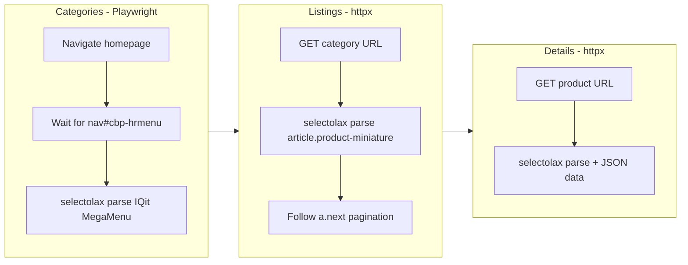

# Add Technopro Shop Scraper

New shop: `technopro/` following the same isolated-shop rules. PrestaShop + IQit MegaMenu. CSR homepage (Playwright for categories), SSR listings and details (httpx + selectolax) -- same hybrid as [scoop/scraper.py](scoop/scraper.py) and [skymill/scraper.py](skymill/scraper.py).

## Architecture




## Key differences from other shops

- **Platform**: PrestaShop + IQit MegaMenu (unique to this shop)
- **Nav container**: `nav#cbp-hrmenu > ul` -- horizontal mega menu, not vertical
- **Category structure**: Column-based mega menu with 3 levels:
  - Top: `li.cbp-hrmenu-tab > a.nav-link` with `span.cbp-tab-title`
  - Low: `div.cbp-hrsub div.cbp-menu-column` -- column headers from `.menu-title` or `p strong a`
  - Sub: `div.cbp-menu-column ul li > a` -- **recursive nested ULs** for deep tree
- **Listing element**: Standard PrestaShop `article.product-miniature.js-product-miniature`
- **Image**: `img.product-thumbnail-first` with both `src` and `data-src` (lazy loaded)
- **Price**: `span.product-price[content]` -- content attr for numeric
- **Availability on listings**: Badge-based: `.badge.badge-success.product-available` (in stock), `.badge.badge-danger.product-unavailable` (OOS), `.badge.product-unavailable-allow-oosp` (orderable OOS)
- **Listing extras**: reference `div.product-reference`, brand `div.product-brand a`, description_short
- **Detail title**: `h1.page-title span`
- **Detail images**: Gallery via `div.product-images-large .swiper-slide img` (Swiper slider)
- **JSON data**: `#product-details[data-product]` fallback

## Files to create

### `technopro/config.py`

- `BASE_URL = "https://www.technopro.com.tn"`
- `PLAYWRIGHT_TIMEOUT = 15000`, `PLAYWRIGHT_HEADLESS = True`
- `PLAYWRIGHT_WAIT_SELECTOR = "nav#cbp-hrmenu ul > li.cbp-hrmenu-tab > a.nav-link"`
- `CATEGORY_SELECTORS` -- IQit MegaMenu:
  - `nav_container`: `nav#cbp-hrmenu > ul`
  - `top_items`: `nav#cbp-hrmenu > ul > li.cbp-hrmenu-tab`
  - `top_link`: `a.nav-link`
  - `top_name`: `span.cbp-tab-title`
  - `mega_panel`: `div.cbp-hrsub`
  - `low_columns`: `div.cbp-menu-column`
  - `low_title`: `.menu-title, p strong a, p strong`
  - `low_title_link`: `p strong a, .menu-title a`
  - `sub_items`: `ul li > a` (recursive)
  - `link_fallback`: `a[href]`
- `LISTING_SELECTORS`: element `article.product-miniature.js-product-miniature`, `data-id-product`, name `h2.product-title a`, price `span.product-price` (content attr), old_price `span.regular-price`, reference `div.product-reference`, brand `div.product-brand a`, image `img.product-thumbnail-first` (src + data-src), availability badges
- `PAGINATION_SELECTORS`: next_page `a#infinity-url-next, ul.page-list a.next`, `?page={n}`
- `DETAIL_SELECTORS`: title `h1.page-title span`, reference `span:nth-of-type(2)`, brand `img[alt]`, price `.current-price .product-price[content]`, old_price, discount badge, availability `#product-availability`, description, specs `dl.data-sheet`, images (main + Swiper gallery), json_data `#product-details[data-product]`
- Standard retry/delay/concurrency/httpx/paths/UA/header sections

### `technopro/scraper.py`

Based on [skymill/scraper.py](skymill/scraper.py) architecture (Playwright categories + httpx SSR):

- **Categories (Playwright)**: Launch browser, navigate to `BASE_URL`, wait for IQit mega menu. Parse `li.cbp-hrmenu-tab` top items. For each, find `div.cbp-hrsub` mega panel. Inside, iterate `div.cbp-menu-column` for low-level headers (extract link from `p strong a` or `.menu-title a`). Sub items from `ul li > a` inside each column -- must handle recursive nested ULs. Dedup by URL.
- **Listings (httpx)**: Parse `article.product-miniature`, ID from `data-id-product`, name from `h2.product-title a`, price from `span.product-price[content]`, availability from badge classes. Paginate via `a#infinity-url-next` or `a.next`.
- **Details (httpx)**: Parse title, reference, brand (alt), price (content attr), discount badge, availability, description, specs (dl), images (main + Swiper gallery), JSON data fallback.
- **Queue/diff/patch/history/summary/cleanup**: Same self-contained logic

## Project structure

```
technopro/
    __init__.py
    config.py
    scraper.py
    data/          (created at runtime)
```

Run with: `python -m technopro.scraper`