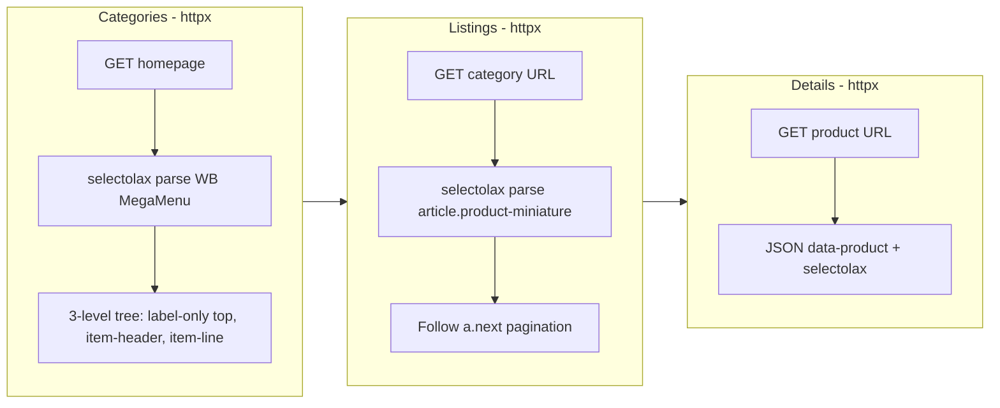

# Add Tunisianet Shop Scraper

New shop: `tunisianet/` following the same isolated-shop rules. PrestaShop + WB MegaMenu. **Fully SSR** -- httpx + selectolax for categories, listings, AND details. Same architecture as [spacenet/scraper.py](spacenet/scraper.py).

## Architecture




Closest to [spacenet/scraper.py](spacenet/scraper.py) (fully SSR, httpx-only), but with WB MegaMenu (not SP Mega Menu), label-only top categories, and a JSON-primary detail model.

## Key differences from Spacenet

- **Platform**: PrestaShop + WB MegaMenu (not SP Mega Menu)
- **Nav container**: `div#_desktop_top_menu div.wb-menu-vertical ul.menu-content.top-menu`
- **Top categories are label-only**: `li.level-1 > div.icon-drop-mobile > span` -- no URL on top-level items
- **Low categories**: `li.menu-item.item-header > a` (not `li.item-2`)
- **Sub categories**: `li.menu-item.item-line > a` (not `li.item-3`)
- **Listing element**: Standard `article.product-miniature.js-product-miniature` (not div)
- **Listing name**: `h2.h3.product-title a` / `h2.product-title a`
- **Listing image**: `img.center-block[src]` with `data-full-size-image-url` fallback
- **Listing extras**: hidden inputs (`hit_ref`, `hit_id`, `hit_qte`), store availability divs, discount badge + flag
- **Detail model is JSON-primary**: Title, price, old_price, discount, reference, images, features all from `#product-details[data-product]` JSON. CSS selectors are fallback only.
- **Out of stock**: `div.product-out-of-stock` notice element
- **No per-shop availability table** (unlike spacenet) -- instead has `store-availability-list` divs
- **No installment plans**

## Files to create

### `tunisianet/config.py`

- `BASE_URL = "https://www.tunisianet.com.tn"`
- No Playwright settings (fully SSR)
- `CATEGORY_SELECTORS` -- WB MegaMenu (3-level, label-only top):
  - `nav_container`: `div#_desktop_top_menu div.wb-menu-vertical ul.menu-content.top-menu`
  - `top_items`: `ul.menu-content.top-menu > li.level-1`
  - `top_name`: `div.icon-drop-mobile > span`
  - `top_link`: None (label-only, no URL on top categories)
  - `low_items`: `li.menu-item.item-header > a`
  - `sub_items`: `li.menu-item.item-line > a`
  - `link_fallback`: `a[href]`
- `URL_PATTERNS`: `id_from_url: r"/(\d+)(?:-|$)"`
- `LISTING_SELECTORS`:
  - `element`: `article.product-miniature.js-product-miniature`
  - `id_attr`: `data-id-product`
  - `name`: `h2.product-title a`
  - `url`: `h2.product-title a`
  - `image`: `a.thumbnail.product-thumbnail img.center-block`, attrs `["src", "data-full-size-image-url"]`
  - `price`: `span.price[itemprop='price']`
  - `old_price`: `span.regular-price`
  - `discount`: `span.discount-amount.discount-product`
  - `reference`: `span.product-reference`
  - `brand`: `div.product-manufacturer img.manufacturer-logo`, brand_attr `alt`
  - `description_short`: `div.listds a`
  - `description_short_fallback`: `div[id^='product-description-short-']`
  - `availability`: `in_stock` = `#stock_availability span.in-stock`
  - `store_availability`: `in_stock_store` = `div.store-availability-list.stock`, `out_of_stock_store` = `div.store-availability-list.hstock`
- `PAGINATION_SELECTORS`:
  - `next_page`: `a.next.js-search-link`
  - `url_pattern`: `?page={n}`
- `DETAIL_SELECTORS`:
  - `json_data`: `#product-details[data-product]`, `json_data_attr`: `data-product`
  - `json_fields`: mapping of JSON keys (id_product, name, price_amount, price, old_price, discount, reference, images, features, etc.)
  - `out_of_stock_notice`: `div.product-out-of-stock`
  - `description`: `div#description div.product-d`
  - `specs`: container `dl.data-sheet`, key `dt.name`, value `dd.value`
- Standard retry/delay/concurrency/httpx/paths/UA/headers (same as spacenet)

### `tunisianet/scraper.py`

Based on [spacenet/scraper.py](spacenet/scraper.py) architecture (httpx-only, no Playwright):

- **Categories (httpx)**: GET homepage, selectolax parse `ul.menu-content.top-menu`. For each `li.level-1`, get name from `div.icon-drop-mobile > span` (no URL -- top-level is label-only). Low categories from `li.menu-item.item-header > a`. Sub categories from `li.menu-item.item-line > a`. Dedup by URL. Use `_css_first_safe` helper (from technopro pattern) for optional selectors.
- **Listings (httpx)**: Parse `article.product-miniature`, ID from `data-id-product`, name from `h2.product-title a`, price from `span.price[itemprop='price']`, image from `img.center-block` (src + data-full-size-image-url), availability from `#stock_availability span.in-stock` presence. Paginate via `a.next.js-search-link`.
- **Details (httpx)**: **JSON-primary approach** -- parse `#product-details[data-product]` JSON first for title, price, old_price, discount, reference, images, features. Fall back to CSS selectors for description (`div#description div.product-d`), specs (`dl.data-sheet`), and out-of-stock notice. This is the main difference from other shops where CSS is primary.
- **Queue/diff/patch/history/summary/cleanup**: Same self-contained logic as all other shops

## Project structure

```
tunisianet/
    __init__.py
    config.py
    scraper.py
    data/          (created at runtime)
```

Run with: `python -m tunisianet.scraper`